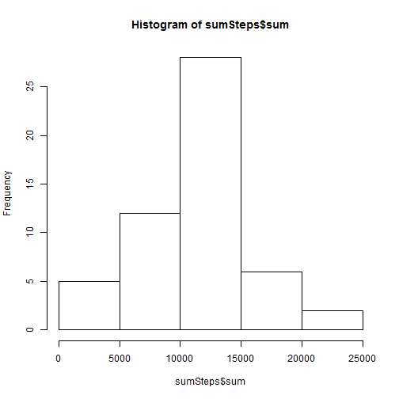
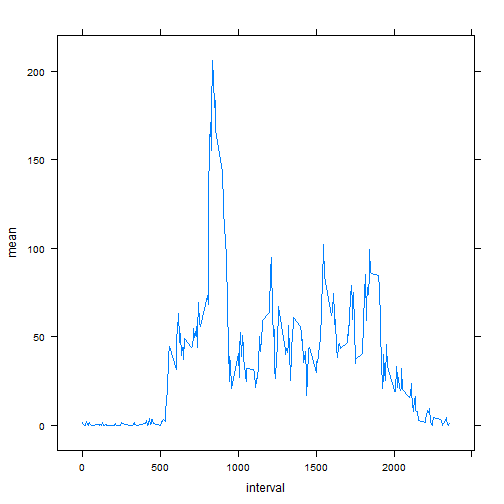
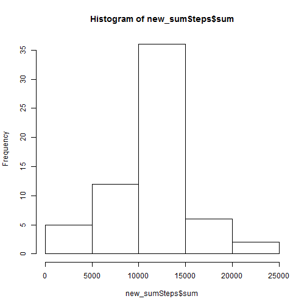
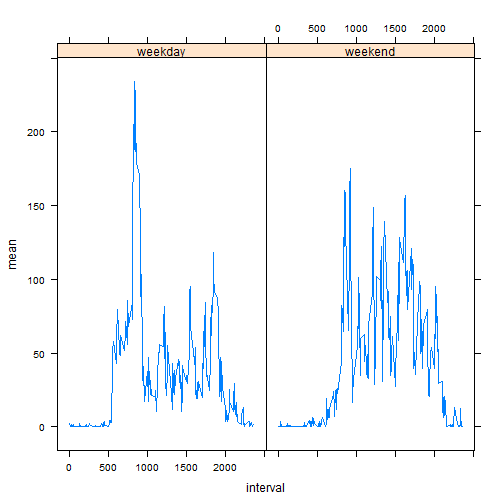

##### Loading (installing if needed) some packages

```r
if(!('plyr' %in% installed.packages()[,'Package'])){install.packages('plyr')}
if(!('ggplot2' %in% installed.packages()[,'Package'])){install.packages('ggplot2')}
if(!('sqldf' %in% installed.packages()[,'Package'])){install.packages('sqldf')}
if(!('lattice' %in% installed.packages()[,'Package'])){install.packages('lattice')}

library(plyr)
library(ggplot2);
library(lattice);
library(sqldf);
```


## Loading and preprocessing the data


```r
setwd("C:/GONZALO/INFO/COURSERA/Reproducible Research/Peer Assessment 1/");
activity=read.csv('activity.csv');
activity$datetime=as.POSIXct(activity$date)+activity$interval*60
```

## What is mean total number of steps taken per day?

#### 1. Calculate the total number of steps taken per day

```r
sumSteps=ddply(activity,~date,summarise,sum=sum(steps));
```


#### 2.Make a histogram of the total number of steps taken each day

```r
hist(sumSteps$sum)
```

 


#### 3.Calculate and report the mean and median of the total number of steps taken per day

```r
meanStepsPerDay=mean(sumSteps$sum,na.rm=T);
meanStepsPerDay_char=as.character(round(meanStepsPerDay,1))
medianStepsPerDay=median(sumSteps$sum,na.rm=T);
```

the mean number of steps per day is 10766.2, and the median is 10765 


## What is the average daily activity pattern?

#### 1. Make a time series plot (i.e. type = "l") of the 5-minute interval (x-axis) and the average number of steps taken, averaged across all days (y-axis)

```r
intervals=ddply(activity,~interval,summarise,mean=mean(steps,na.rm=T));
xyplot(mean~interval,data=intervals,type='l')
```

 

#### 2.Which 5-minute interval, on average across all the days in the dataset, contains the maximum number of steps?

```r
maxInterval=intervals[which.max(intervals$mean),]
maxInterval$time=format.POSIXct(as.POSIXct('2000-01-01')+maxInterval$interval*60, "%H:%M")
```

The 5-minute interval which contains the maximun number of steps on average is the: 835th interval that is the following time:  13:55. The average number of steps is: 206.17

## Imputing missing values

#### 1.Calculate and report the total number of missing values in the dataset (i.e. the total number of rows with NAs)

```r
numberOfNas=sum(is.na(activity$steps))
```
the total number of missing values in the dataset is 2304

#### 2.Devise a strategy for filling in all of the missing values in the dataset. The strategy does not need to be sophisticated. For example, you could use the mean/median for that day, or the mean for that 5-minute interval, etc.

I will use the the mean for that 5-minute interval.


```r
activity=sqldf("select a.*,b.mean as intervalMean from activity a left join intervals b on a.interval=b.interval")
activity$steps_without_NAs=ifelse(is.na(activity$steps),activity$intervalMean,activity$steps)
```

#### 3.Create a new dataset that is equal to the original dataset but with the missing data filled in.

```r
new_activity=data.frame(steps=activity$steps_without_NAs,date=activity$date,interval=activity$interval)
```

#### 4.Make a histogram of the total number of steps taken each day and Calculate and report the mean and median total number of steps taken per day. Do these values differ from the estimates from the first part of the assignment? What is the impact of imputing missing data on the estimates of the total daily number of steps?

```r
new_sumSteps=ddply(new_activity,~date,summarise,sum=sum(steps));
hist(new_sumSteps$sum)
```

 

```r
compare=sqldf("select a.date,a.sum as sum,b.sum as new_sum from sumSteps a join new_sumSteps b on a.date=b.date")

total_daily_number_of_steps=c(original=mean(compare$sum,na.rm=T),new=mean(compare$new_sum))
```

The original total daily number of steps is 10766.19 and the total daily number of steps with the missing data filled in is 10766.19. So there is no difference between the two calculations. (This is a general property)

## Are there differences in activity patterns between weekdays and weekends?

#### 1.Create a new factor variable in the dataset with two levels - "weekday" and "weekend" indicating whether a given date is a weekday or weekend day.

```r
activity$weekday=as.factor(ifelse(weekdays(as.Date(activity$date)) %in% c('sábado','domingo','saturday','sunday'),'weekend','weekday'));
#My computer LOCALE is Spanish (I use also English just in case yours is in English)
```

#### 2.Make a panel plot containing a time series plot (i.e. type = "l") of the 5-minute interval (x-axis) and the average number of steps taken, averaged across all weekday days or weekend days (y-axis). See the README file in the GitHub repository to see an example of what this plot should look like using simulated data.

```r
weekend=activity[activity$weekday=='weekend',]
weekday=activity[activity$weekday=='weekday',]
intervals_weekday=ddply(weekday,~interval,summarise,mean=round(mean(steps,na.rm=T),2));
intervals_weekend=ddply(weekend,~interval,summarise,mean=round(mean(steps,na.rm=T),2));
intervals_weekday$weekday='weekday'
intervals_weekend$weekday='weekend'
intervals_all=rbind(intervals_weekday,intervals_weekend)
intervals_all=intervals_all[order(intervals_all$interval),]

xyplot(mean~interval|weekday,data=intervals_all,type='l')
```

 
